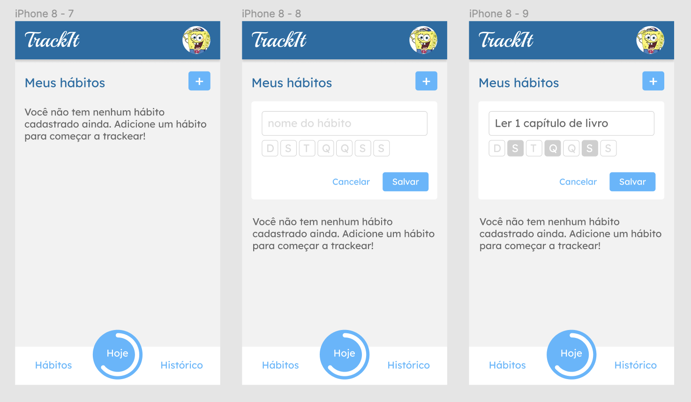

<h1 align="center">Track it</h1>
 Uma aplicação completa de acompanhamento de hábitos, com cadastro, login e muitas bibliotecas. Acompanhe e forme hábitos de forma eficaz com o TrackIt!
  

💻 Como Rodar:

- Clone o repositório para sua máquina:
    - git clone https://github.com/curtyraissa/trackit.git
    - cd trackit

- Instale as dependências do projeto:
    - npm install

- Execute o projeto:
    - npm start

    Acesse o projeto em seu navegador em http://localhost:3000.

✅ Sobre

- Tela de Login (rota /)
    - Envio de email e senha para a API conforme documentação.
    - Interface de carregamento com campos e botão desabilitados.
    - Redirecionamento para a rota /hoje após o login bem-sucedido.
    - Exibição de alerta em caso de falha no login.
    - Redirecionamento para a rota /cadastro ao clicar no link "Cadastrar".
- Tela de Cadastro (rota /cadastro)
    - Envio de dados para a API conforme documentação.
    - Interface de carregamento com campos e botão desabilitados.
    - Redirecionamento para a rota / (rota de Login) após o cadastro bem-sucedido.
    - Exibição de alerta em caso de falha no cadastro.
    - Redirecionamento para a rota / ao clicar no link "Já tem uma conta? Faça login".
- Topo e Menu
    - Posicionamento fixo para o topo e o menu.
    - Exibição da foto do usuário conforme layout.
    - Navegação para as rotas /habitos, /hoje e /historico.
    - Barra de progresso circular na rota /hoje indicando a porcentagem de conclusão dos hábitos de hoje.
- Tela de Hábitos (rota /habitos)
    - Carregamento dos hábitos do usuário com requisição à API.
    - Opção para deletar um hábito com confirmação.
    - Exibição de mensagem se o usuário não tiver hábitos cadastrados.
    - Formulário de cadastro de hábito com validação de dias da semana.
    - Envio de dados para a API com interface de carregamento.
    - Atualização automática da lista de hábitos após o cadastro bem-sucedido ou falha.
    - Manipulação de erros com alertas.
    - Opção de cancelar o cadastro de hábito.
- Tela de Hoje (rota /hoje)
    - Carregamento dos hábitos do usuário para o dia atual.
    - Exibição do dia atual usando a biblioteca dayjs.
    - Exibição da porcentagem de conclusão dos hábitos de hoje ou mensagem "Nenhum hábito concluído ainda".
    - Marcação e desmarcação de hábitos como concluídos com atualização automática.
    - Destaque em verde para a sequência atual.
    - Destaque em verde para o recorde do usuário quando a sequência atual o iguala.
- Tela de Histórico (rota /historico)
    - Exibição de texto conforme layout.

## 🛠 &nbsp;Skills

  
  
  
  
          
  
                                     

## 🚀 &nbsp;Links

- [Figma](https://www.figma.com/file/3r8MSf9dIPuFlvZHuHTZXF/TrackIt?node-id=0%3A1&t=Dh5InK9yGfFESOP0-0). 
- [Deploy](https://projeto11-trackit-xi-seven.vercel.app/). 

## 💬 &nbsp;Contact

Feito por [Raissa Curty](https://github.com/curtyraissa)!

&nbsp;